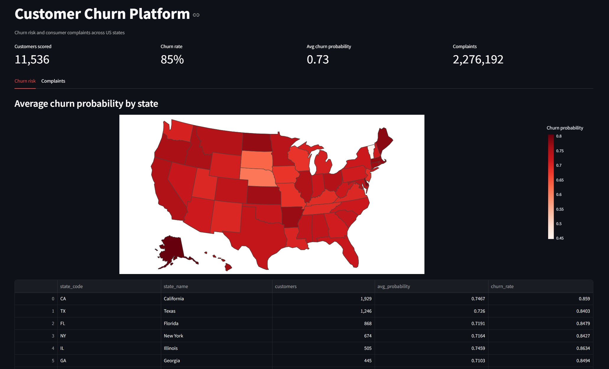

# Customer Churn Platform

End-to-end churn prediction on e-commerce data: PySpark pipeline for the data processing, an ML classifier to predict churn risk, an NLP layer on top of real consumer complaint texts, and a dashboard to show the results. Everything runs in Docker, locally and on Google Cloud.

Started July 2026, actively being built. The roadmap below shows where the project stands.



## Architecture

```
                      ┌─────────────────┐
  Raw data (CSV) ───▶ │  PySpark ETL     │ ───▶ Feature store (Postgres)
  structured +        │  ingestion +     │
  free-text sources   │  transformation  │
                      └────────┬─────────┘
                               │
                 ┌─────────────┴─────────────┐
                 ▼                            ▼
        ┌─────────────────┐         ┌──────────────────┐
        │  ML classifier   │         │   NLP pipeline    │
        │  (churn risk)    │         │  (text signals)   │
        └────────┬─────────┘         └─────────┬─────────┘
                  └─────────────┬───────────────┘
                                ▼
                      ┌──────────────────┐
                      │    Dashboard      │
                      │ (churn risk view) │
                      └──────────────────┘
```

The Docker and deployment topology (Traefik, Postgres, GCP) will be documented in `docs/architecture.md` once that part is built.

## Stack

| Layer | Tools |
|---|---|
| Data processing | PySpark 4 (in Docker, jupyter/pyspark-notebook image) |
| Storage | PostgreSQL, parquet for the intermediate datasets |
| ML | scikit-learn |
| NLP | spaCy / scikit-learn text pipelines |
| Dashboard | Streamlit |
| Infra | Docker Compose, Traefik, GCP |
| Language | Python 3.13 |

## Data

Two datasets, both US based so state level comparison is possible:

- [TheLook eCommerce](https://www.kaggle.com/datasets/mustafakeser4/looker-ecommerce-bigquery-dataset): synthetic e-commerce data (100k users, 2.4M web events, orders from 2019 to 2024). Used for the churn label and the customer features. The project scopes to the 22.5k US users, of which about 11.5k had orders before the cutoff and are actually scored.
- [CFPB Consumer Complaint Database](https://www.consumerfinance.gov/data-research/consumer-complaints/): 2.36M real consumer complaints with narratives. This is the input for the NLP part. After cleaning (US states, valid product, dedupe) about 2.28M reach the served layer.

Download instructions and schema notes: [`data/README.md`](data/README.md).

## How the churn label works

TheLook has no churn column, so the label is derived from order behavior. A cutoff date is placed 180 days before the last order in the dataset. Customers with at least one order before the cutoff are in scope, and whoever doesn't order again after the cutoff counts as churned. All features are computed from data before the cutoff only, so the model can't peek at the answer (no label leakage).

The 180 day window wasn't a random pick: the median time between two orders from the same customer is 155 days, so someone who stays quiet for 6 months is past their normal rhythm. The full analysis is in [`notebooks/02_churn_window.ipynb`](notebooks/02_churn_window.ipynb). About 85% of customers churn under this definition, which sounds high but is normal for e-commerce, most shoppers buy once and never come back. The class imbalance gets handled in the ML step.

## Roadmap

- [x] Repo structure
- [x] Ingestion with explicit Spark schemas (TheLook + CFPB)
- [x] EDA notebooks
- [x] Churn label with temporal cutoff
- [x] Feature engineering (recency, frequency, spend, browsing behavior) into one training table
- [x] ML classifier + evaluation
- [x] NLP pipeline on the complaint narratives
- [x] Postgres serving schema (star schemas for churn scores and complaint stats)
- [x] Streamlit dashboard (churn risk and complaints, US map per state)
- [ ] Metabase as second user-facing app on the same database
- [ ] Docker Compose stack with Traefik reverse proxy
- [ ] GCP deployment with Cloudflare DNS and a ZeroSSL certificate

## Project log

Short notes on what got built when, and what I learned along the way.

**July 11-13.** Repo setup, dataset choice and ingestion. Picked TheLook (structured, all US states) plus CFPB complaints (real free text) over the usual 7k row telco churn csv, mainly because deriving my own churn label from raw behavior is a better exercise than consuming a premade label column. Explicit Spark schemas caught a fun data bug on day one: user ids stored as float text because the dataset was exported through pandas. Also fought three Windows specific Spark issues, which pushed me to run Spark in Docker from day two onward.

**July 14.** Reworked the churn label after realizing my first version would leak: recency features computed at the same date as the label literally contain the answer. New setup uses a temporal cutoff, features from before it, label from the 180 days after it. Picked 180 days from the actual reorder gap distribution (median 155 days). Built the feature table with PySpark and wrote it as parquet.

**July 15-16.** Trained the churn classifier (random forest won, test ROC-AUC 0.62, honest number for synthetic data and I can explain why suspiciously high scores would have worried me more). Converted the 3GB complaints csv to parquet after learning the hard way that a multiline csv reads as a single Spark task. Built a complaint topic classifier with TF-IDF and logistic regression, macro F1 0.65 over 12 products.

**July 18-19.** Started the serving layer, hands on in psql and PyCharm. Postgres 17 in a container with a named volume, star schema design for two business processes: churn scoring (one row per customer per scoring date) and complaint stats (one row per state, product and month). Two fact tables sharing dim_state and dim_date turned out to have a name, a fact constellation, which I had not seen in class where we built a single star. Composite primary keys encode each table's grain, foreign keys enforce the star shape. The schema is saved as a Postgres init script so a fresh container builds it automatically. Also ran all notebooks so the outputs render on the repo, and tagged the churn scores with their train/validation/test split: evaluation plots now use held out customers only, since a random forest scores its own training rows near perfectly and that view flatters the model.

## Running it

1. Download the raw data into `data/raw/`, see [`data/README.md`](data/README.md).
2. Start the Spark container (this is also the Jupyter server for the notebooks):

```powershell
docker network create qs-data
docker run -d --name qs-spark --network qs-data -p 8888:8888 `
  -v ${PWD}:/home/jovyan/work quay.io/jupyter/pyspark-notebook:latest
```

3. Build the training dataset:

```powershell
docker exec -e PYTHONPATH=/usr/local/spark/python:/usr/local/spark/python/lib/py4j-0.10.9.9-src.zip:/home/jovyan/work `
  qs-spark bash -c "cd /home/jovyan/work && python -m src.processing.build_dataset"
```

Output lands in `data/processed/churn_dataset` as parquet. For the notebooks: `docker logs qs-spark` gives the Jupyter URL with the token, or connect PyCharm to it as an external Jupyter server.

## License

MIT, see [LICENSE](LICENSE).
